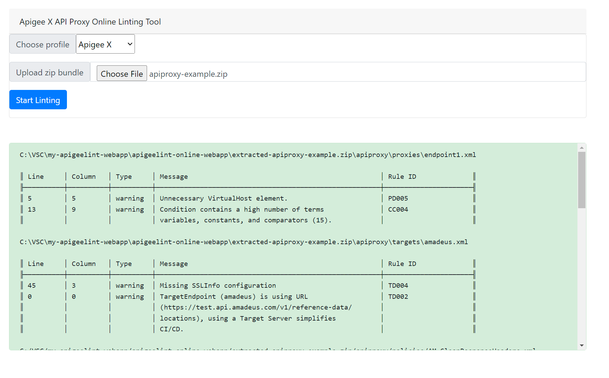

# apigeelint-online-webapp
[](LICENSE)

[](https://github.com/davormilutinovic/apigeelint-online-webapp/actions/workflows/run-test.yaml)


Apigeelint is command line linting tool for Apigee API Proxies. This is just a simple webapp wrapper for this tool.


You can find apigeelint repo here [apigeelint](https://github.com/apigee/apigeelint).

## Status

At this point, this webapp is using table formatter and has just a basic functionality, but enough for online linting purpose.

You can test it here [apigeelint-online-webapp](https://apigeelint-online-webapp.onrender.com/)

> **Note** : Demo runs on free and slow instance. Be patient, it will need few seconds to spinn up the instance or to process the bundle.

## Installation


If you use it locally you can install apigeellint using npm. But, there is a minimum version of `npm` required.

1. First verify the version of npm:
   ```
   npm --version
   ```

   If the version is 8.3.0 or later, then proceed to step 2.
   If the version is less than `8.3.0`, then update:
   ```
   npm install npm@8.3.0 -g
   ```

   Alternatively, you may choose to get the latest npm:
   ```
   npm install npm@latest -g
   ```

3. Copy this repo on your local machine, go to directory and use following commands:
   ```
   npm install
   ```

4. Run node.js app
   ```
   node server.js
   ```

## Usage

1. Go to http://localhost:3000 in your browser
2. Upload you Apigee API Proxy or Shared flow as zipped bundle (use "Choose File")
3. Select "Start Linting"
4. The linting result will be presented on screen.



## Release Notes

### Release v0.0.1

## License and Copyright

This material is licensed under the [Apache 2.0 License](LICENSE).

## Disclaimer

This tool is open-source software. It is not an officially supported product
